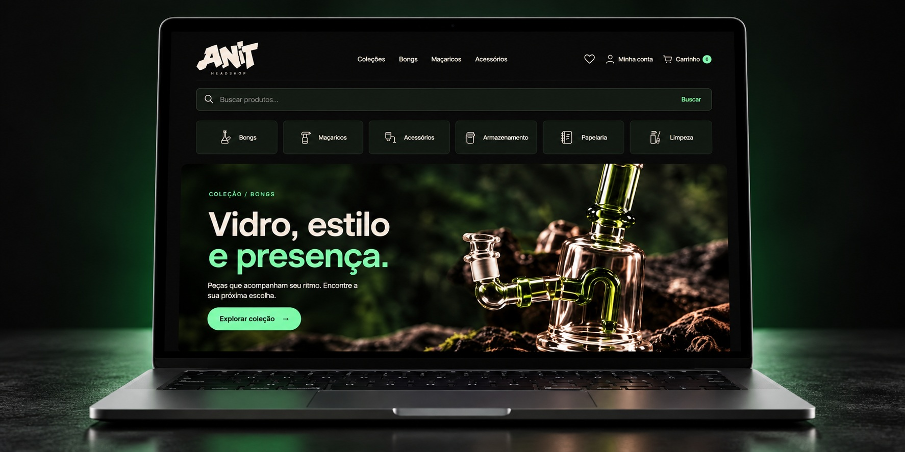

# ANIT Headshop



Loja virtual de bongs, maçaricos e acessórios, com identidade grafite, catálogo por categorias e jornada de compra integrada ao Supabase.

[Acessar a loja](https://anit-headshop.ygor-miquelato.chatgpt.site) · [Repositório](https://github.com/lenixeduardo/anit)

## Sobre o projeto

A ANIT Headshop combina uma vitrine com foco nos produtos e uma interface escura com detalhes verdes. O projeto reúne navegação por coleções, busca, favoritos, carrinho, autenticação e gestão de pedidos.

A aplicação usa Next.js para executar as rotas de servidor e servir as páginas da loja. A vitrine principal é composta por HTML, CSS e JavaScript em `public/`; a rota inicial redireciona para `/index.html`.

## Funcionalidades

- Catálogo conectado ao banco, com busca, filtros por categoria e ordenação por preço ou nome.
- Coleções de bongs, maçaricos, acessórios, armazenamento, papelaria e limpeza.
- Página de produto com imagem, descrição, preço, quantidade e disponibilidade.
- Favoritos e carrinho persistidos no navegador.
- Cadastro, login, recuperação de senha e gerenciamento da conta.
- Endereço do cliente e cópia do endereço preservada no pedido.
- Checkout com criação de pedido e PIX por QR Code e código copia e cola.
- Histórico de pedidos do cliente e painel administrativo para produtos e pedidos.
- Adaptador de cotação de frete pelo Melhor Envio, com ativação por configuração.
- Layout adaptado a desktop e celular, com navegação inferior no mobile.

O QR Code PIX é gerado pela aplicação. Sua geração não representa confirmação automática do pagamento. A cotação externa de frete depende de credenciais, migrações e medidas cadastradas dos produtos.

## Tecnologias

| Camada | Tecnologias |
| --- | --- |
| Aplicação e API | Next.js 16, React 19, TypeScript |
| Vitrine | HTML, CSS e JavaScript |
| Estilos e build | Tailwind CSS 4, PostCSS, esbuild |
| Banco e autenticação | Supabase, PostgreSQL, `@supabase/ssr` |
| Pagamento | PIX e geração de QR Code com `qrcode` |
| Frete | Integração com Melhor Envio |
| Qualidade | ESLint, scripts de validação e PGlite |

## Executar localmente

Use Node.js 24 e npm. Os scripts de preparação usam `process.loadEnvFile` para carregar os arquivos de ambiente.

```bash
git clone https://github.com/lenixeduardo/anit.git
cd anit
npm ci
```

Crie `.env.local` na raiz:

```dotenv
NEXT_PUBLIC_SUPABASE_URL=https://seu-projeto.supabase.co
NEXT_PUBLIC_SUPABASE_PUBLISHABLE_KEY=sua-chave-publica
SHIPPING_ENABLED=false
```

O código também aceita `NEXT_PUBLIC_SUPABASE_ANON_KEY` como alternativa à chave pública acima. Configure seu próprio projeto Supabase; o repositório contém valores públicos de fallback para o projeto original.

```bash
npm run dev
```

Acesse `http://localhost:3000`. Os scripts `predev` e `prebuild` geram a configuração pública e o bundle de autenticação automaticamente.

### Banco e autenticação

Os scripts SQL de configuração ficam em `supabase/`, incluindo `setup-anit.sql`, `admin-access.sql`, `pix-checkout.sql` e `order-management.sql`. Revise os scripts e as dependências antes de aplicá-los ao seu banco. Configure também as URLs de redirecionamento da autenticação no Supabase, incluindo `/auth/callback` no domínio utilizado.

### Frete

Para ativar a cotação externa, configure no servidor:

```dotenv
SUPABASE_SERVICE_ROLE_KEY=sua-chave-administrativa
MELHOR_ENVIO_TOKEN=seu-token
MELHOR_ENVIO_USER_AGENT=ANIT Headshop contato@seu-dominio.com
SHIPPING_ORIGIN_POSTAL_CODE=00000000
MELHOR_ENVIO_SANDBOX=true
SHIPPING_ENABLED=false
```

Cadastre peso e dimensões reais dos produtos embalados, aplique as migrações correspondentes e siga [a documentação de frete](docs/shipping.md) antes de ativar `SHIPPING_ENABLED=true`. O ambiente sandbox bloqueia a criação de PIX com suas cotações. A integração de cotação não compra etiquetas nem agenda coleta.

`SUPABASE_SERVICE_ROLE_KEY` e `MELHOR_ENVIO_TOKEN` são exclusivos do servidor e não devem receber o prefixo `NEXT_PUBLIC_`.

## Comandos

| Comando | Uso |
| --- | --- |
| `npm run dev` | Iniciar o ambiente de desenvolvimento |
| `npm run build` | Gerar o build de produção |
| `npm start` | Executar o build de produção |
| `npm run lint` | Executar o ESLint |
| `npm run test:auth` | Executar as validações de autenticação |

## Estrutura

| Diretório | Responsabilidade |
| --- | --- |
| `public/` | Páginas da loja, scripts, estilos e imagens |
| `public/assets/anit/` | Identidade visual, banners e ícones da ANIT |
| `src/app/api/` | Rotas de produtos, pedidos, PIX, frete e configuração |
| `src/app/auth/` | Callback de autenticação |
| `src/lib/` | Integrações Supabase, autenticação, PIX e frete |
| `supabase/` | Scripts SQL de configuração e migração |
| `scripts/` | Preparação do build e validações |
| `docs/` | Documentação técnica complementar |
| `screenshots/` | Capturas das telas |

## Identidade visual

Logotipo grafite em tom areia, fundos próximos ao preto e verde como destaque. As imagens dos produtos e os banners das coleções conduzem a experiência, com tipografia legível e componentes consistentes entre as telas.

## Autor

Desenvolvido por [Eduardo Lenix](https://github.com/lenixeduardo).

## Licença

O repositório ainda não declara uma licença de uso. A identidade ANIT e os materiais visuais pertencem aos respectivos titulares.
